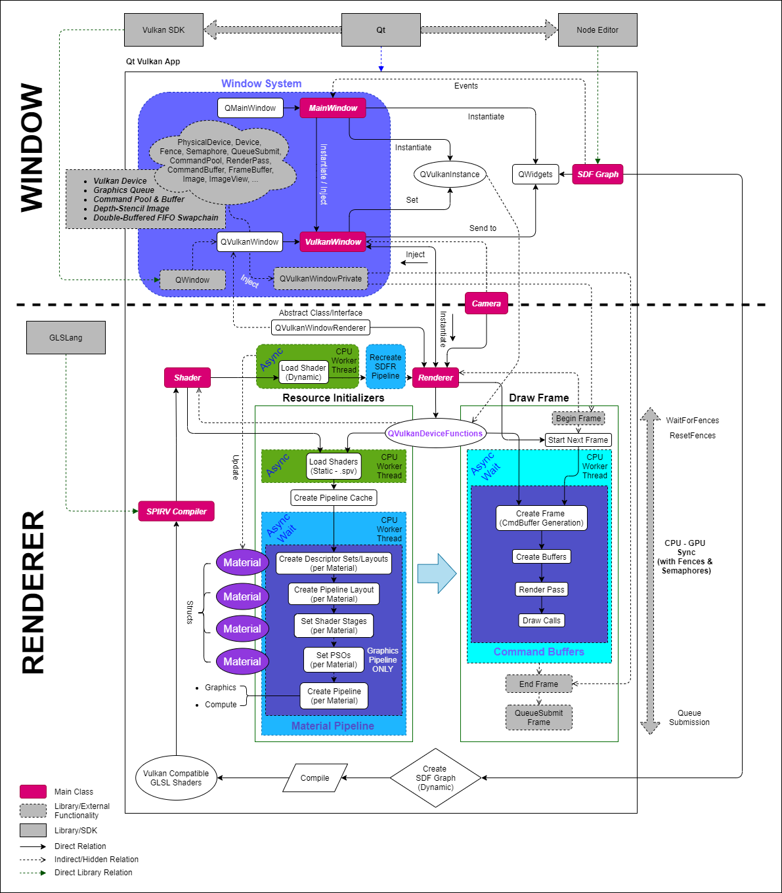

# masters-project

## Requirements

- cmake v3.12+ (tested with 3.19 - for faster build use v3.16+)
- Qt v5.10+ (tested with 5.15)
- Vulkan SDK v1.2.x (tested with v1.2.176.1)

## Build

```shell
cmake -DCMAKE_TOOLCHAIN_FILE=${VCPKG_PATH} -DVCPKG_TARGET_TRIPLET=x64-windows ..
cmake --build .
```

#### CMake Compilation Performance

Compiling source class implementations when split into multiple source files (i.e., Partial Class), to allow for
readability/maintainability, may increase compilation time.

It essentially creates extra multiple `obj` files for each split source file and therefore increases the size of
compilation unit. There are a few ways to alleviate this and increase compilation performance which need to be reviewed, as below:

- UNITY_BUILD (cmake 3.16+)
- Pre-compiled Headers/PCH (cmake 3.16+)
- Module Header Units (C++ 20 Modules)

## Design

### Vulkan vs. DirectX vs. OpenGL

***Vulkan Advantages***

- Multi-threading & Multi-GPU
- Reducing driver overhead & CPU Load
  - preprocess/bake batches of calls in advance to submit to command queues per frame

### Qt Vulkan

#### High Level Architecture



***Support for Vulkan rendering was added to the Qt framework since v5.10***

- `QMainWindow`'s child class (`MainWindow`) instantiates `QVulkanInstance` and `QVulkanWindow`'s child (`VulkanWindow`), and sets the Vulkan instance to the `VulkanWindow`
- `QVulkanWindow` is the equivalent of `QOpenGLWindow`
- `QVulkanWindowRenderer` injects `QVulkanWindow` and implements Vulkan Device functions (`QVulkanDeviceFunctions`)
- `QVulkanDeviceFunctions` instance created by `QVulkanInstance` is used to:

    - Create/Destroy Shader Module
    - Create/Destroy Buffer
    - Get Buffer Memory Requirements
    - Allocate/Free Memory
    - Bind Buffer Memory
    - Map/Unmap Memory
    - Create/Destroy Descriptor Pool
    - Create/Destroy Descriptor SeyLayout
    - Allocate/Update Descriptor Sets
    - Create/Destroy Pipeline Cache
    - Create/Destroy Pipeline Layout
    - Create/Destroy Graphics Pipeline
    - CmdBeginRenderPass
    - CmdEndRenderPass
    - CmdBindPipeline
    - CmdBindDescriptorSets
    - CmdBindVertexBuffers
    - CmdSetViewport
    - CmdSetScissor
    - CmdDraw

In contrast to using `GLFW`, above Vulkan implementations are already abstracted and handled via `QVulkanDeviceFunctions` where there's no need to create extra classes and functionality for them.

This means, `VkDevice` and its functions can be extracted from `QtVulkanWindow` instance. The same applies to all other `vk` prefixed functions which are invoked by `QVulkanDeviceFunctions` instance.

#### Design Restrictions

- **VulkanWindow Inheritance**
  Currently, couldn't find a way to use one single class consuming and inheriting both `QVulkanWindow` and `QMainWindow` even with `protected` specifiers as they have same public methods signature and therefore cause ambiguous method name lookup.

  Also, instantiating the `QMainWindow` in `VulkanWindow` constructor to, instead, use the `resize` and `show`/`showMaximized` methods of `QVulkanWindow`, does not load an actual window and therefore cannot be used as a workaround.

  Note that, we could inherit `QWindow` to our `VulkanWindow` class and use `QVulkanFunctions` and `QVulkanInstance`, but the limitation would be that `QWidget` functionality is limited and can't have predefined places for Qt widgets.

  So, the only way is to inject (***Dependency Injection - DI***) or instantiate `VulkanWindow` in the `MainWindow` constructor, which may be better in terms of design and testability but with extra distinguished classes.

## Node Editor

TBC

## Shaders (Vulkan Shaders - SPIR-V)

***SPIR-V*** Shaders on `OpenGL` are only available since ***[v4.6+](https://www.khronos.org/opengl/wiki/SPIR-V)***

SPIR-V shader compiler APIs:

- https://github.com/KhronosGroup/glslang
- https://github.com/google/shaderc

Vulkan SDK's `glslang` and `shaderc` are not available via cmake. However, `vcpkg` port of `glslang` has `glslangConfig.cmake` which allows `glslang` to be linked and made available via `cmake` with `#include`.

`shaderc` vcpkg port, also, doesn't have cmake config and cannot be available via `cmake`.

https://github.com/KhronosGroup/glslang/issues/2570

pulling `glslang` and `shaderc` with git submodule also requires a lot of configurations with cmake, which is a huge rabbit hole I don't have time to get into right now! But in any case, `vcpkg` needs to be excluded if we pull in the git repository as otherwise, it will cause conflicts.

***Current Solution***
For the time being, we skip `SPIR-V` runtime shader compilation using above libraries and instead pre-compile shaders to `SPIR-V` bytecodes using a shell script and cmake command.

However, the problem with this solution is that it doesn't work for dynamic shader code loading, as node-based SDF graph editor allows for adding runtime shader instructions.

***SPIRV Notes***

- They do not validate `glsl` version `410` and below (because of second point as it lacks `binding` value, and they need uniform buffers binding).
- They do not validate uniforms without blocks (they need to be wrapped into ubo)
- `in` and `out` variables need to be specified with their locations

## Unity Native Plugin

TBC
